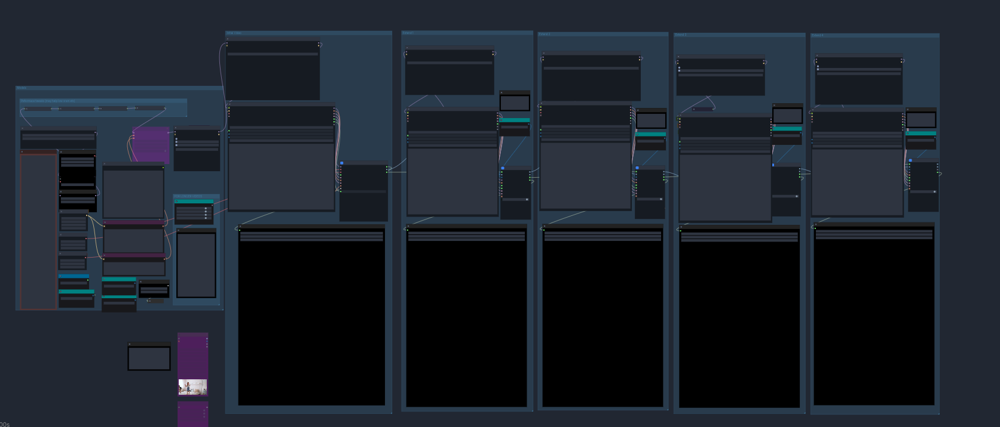
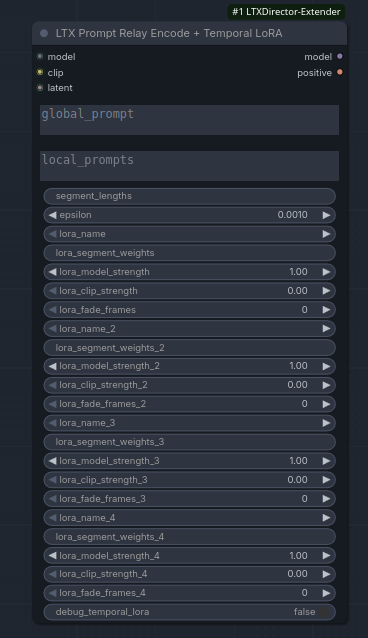

# Yogurt LTXDirector_Extender

Fork of [WhatDreamsCost-ComfyUI](https://github.com/WhatDreamsCost/WhatDreamsCost-ComfyUI) focused on LTX Director extension workflows.

This fork keeps the original node set as its base, and now also includes a separate standalone Prompt Relay + Temporal LoRA node. The tested release focus is still the LTX Director extension fixes; the Temporal LoRA node is included as a separate opt-in path and is not yet validated as part of the LTX Director extension flow.

The main shareable surface here is the **Yogurt LTXDirector_Extender** node and workflow.

## Credits

- **Original repo and node pack:** [WhatDreamsCost/WhatDreamsCost-ComfyUI](https://github.com/WhatDreamsCost/WhatDreamsCost-ComfyUI) by WhatDreamsCost
- **PromptRelay concept:** [Prompt-Relay](https://gordonchen19.github.io/Prompt-Relay/) by Gordon Chen
- **ComfyUI PromptRelay implementation reference:** [kijai/ComfyUI-PromptRelay](https://github.com/kijai/ComfyUI-PromptRelay)

## Scope Of This Fork

This fork is intended to share the LTX Director extension fixes that were validated in a real LTX 2.3 AV extension workflow.

Included in this fork:

- LTX Director extension-specific guide fix for `guide pre_filter_counts != keyframe grid mask length`
- Overlap-aware guide frame placement for extension latents with preserved reference frames at the front
- Overlap-aware PromptRelay timing shift for LTX Director extension passes, including the scaled audio attention path
- Standalone `PromptRelayEncodeWithTemporalLora` node in `prompt_relay_lora.py`
- Inline code comments at the exact decision points that explain why those extension fixes exist

Not bundled here yet:

- Any merged LTX Director + Temporal LoRA workflow path
- Shared workflows for this release

The Temporal LoRA work remains a separate PromptRelay-style node and has **not** been validated in combination with the LTX Director extension path yet. Until that combined path is tested, it should stay separate.

## What Changed

### 1. Guide attention accounting fix

The LTX Director guide node now appends the guide attention metadata that ComfyUI expects for each inserted guide latent. This resolves the failure:

`ValueError: guide pre_filter_counts != keyframe grid mask length`

### 2. Overlap-aware guide timing

Extension latents can start with preserved overlap/reference frames from the previous generation pass. The timeline guide positions are extension-relative, so the guide node now detects that front prefix and shifts guide insert positions forward into the newly generated region.

### 3. Overlap-aware PromptRelay timing

The PromptRelay timing logic now detects when the runtime latent is longer than the schedule-configured latent. When that happens, it treats the extra leading frames as overlap/reference context and shifts the local prompt schedule forward.

That shift is applied to:

- the normal video cross-attention path
- the scaled attention path used by LTX audio conditioning

This matters for extension passes where video and audio conditioning must align to the new section instead of the preserved overlap prefix.

## Yogurt LTXDirector_Extender Workflow

Workflow file:

- `example_workflows/Yogurt_LTXDirector_extender.app.json`



*The Yogurt LTXDirector_Extender workflow: generate the first clip with the standard LTX Director path, then continue with the extender path using prior video and audio context.*

Primary nodes in this fork:

- `LTX Director Extender`
- `LTX Director Guide Extender`
- `LTX Prompt Relay Encode + Temporal LoRA`



*The standalone LTX Prompt Relay Encode + Temporal LoRA node included in this fork. This is kept separate from the tested LTX Director extension path until the combined workflow is validated.*

### What The Workflow Does

The intended flow is:

1. Generate the first clip with the standard **LTX Director** node.
2. Use the **Yogurt LTXDirector_Extender** flow to append new segments.
3. Feed the extender sampler subgraph with the previous clip's video and audio context so the next section continues from what was already generated.

This lets the user keep extending a sequence while preserving context from the earlier result instead of treating each segment as a fresh standalone generation.

### Cut vs Blend In The Sampler Subgraph

Inside the sampler subgraph, there is a choice between cutting frames or blending them depending on the effect you want.

- Use **cut** when you want a harder transition.
- Use **blend** when you want a softer overlap transition.

If you swap this behavior, change the output connector from **cut** to **blend** on that node and reconnect it to the following node in the subgraph.

### Duration Must Match Manually

The duration configured in **LTX Director Extender** must match the duration configured inside the sampler subgraph.

This is manual for now. A `GetNode` attempt was not reliable enough in this workflow, so both places should be set by hand until that is improved.

If those durations do not match, the extension path can drift away from the intended overlap and continuation timing.

### Extending From A Previously Created Video

If you want to extend from a video that already exists:

1. Use a **Load Video** node to bring the previous clip into the workflow.
2. Disable the standard **LTX Director** generation path for the initial clip.
3. Connect the loaded video's frame output and audio output into the extender sampler subgraph.

That lets the extender path continue from an already rendered clip instead of requiring the first section to be regenerated inside the same workflow.

### Practical Runtime Notes

Tested results so far:

- Up to about **150 seconds** of generation on **16 GB VRAM**
- Occasional **64 GB system RAM** exhaustion on the final step for very long runs
- **10 to 15 second** extension durations tend to work consistently

For stability, shorter extension chunks are the safer default. Long chained runs are possible, but they are more likely to hit RAM limits near the end.

### UI Note

The extender workflow is intended to use the renamed fork-specific nodes:

- `LTX Director Extender`
- `LTX Director Guide Extender`
- `LTX Prompt Relay Encode + Temporal LoRA`

If a workflow still references the original `LTXDirector` or `LTXDirectorGuide` node types, it will bind to the upstream WhatDreamsCost nodes instead of the forked extender versions.

## Important Packaging Decision

This fork deliberately does **not** merge the separate PromptRelay Temporal LoRA update into LTX Director yet.

Reason:

- the Temporal LoRA update was developed separately
- the combined LTX Director extension + Temporal LoRA path has not been tested
- shipping them together would make it harder to know whether a regression comes from the LTX extension timing fixes or the LoRA scheduling layer

Instead, this repo now exposes that work as a separate standalone node in `prompt_relay_lora.py`. The clean next step is to test that node against this LTX Director fork before merging any combined workflow support.

## Install

1. Clone this repo into your ComfyUI `custom_nodes` folder.
2. Restart ComfyUI.
3. Re-open your LTX Director extension workflow and reconnect any nodes if your local workflow still points at an older custom-node install.

Example:

```bash
cd /path/to/ComfyUI/custom_nodes
git clone https://github.com/Yogurt1192/LTXDirector-Extender.git
```

The included workflow is designed for the extender node names in this fork. If you install both the upstream repo and this fork side by side, use the extender-named nodes when building or updating workflows.

## Tested Focus

The fixes in this fork were aimed at LTX Director extension workflows with:

- overlap-prefixed extension latents
- timeline image guides
- PromptRelay local prompt scheduling
- audio/video extension passes in the LTX AV path

## Known Limitations

- PromptRelay Temporal LoRA is present here as a separate standalone node, but it is still an untested integration path for LTX Director extension workflows.
- The main shared workflow is `example_workflows/Yogurt_LTXDirector_extender.app.json`, but users still need to set manual durations carefully.
- Extended audio can still produce speech-like output with imperfect lexical accuracy on some prompts. The overlap timing fixes help alignment, but they do not guarantee perfect spoken word fidelity.

## Files To Review First

- `ltx_director_guide.py`
- `prompt_relay.py`
- `prompt_relay_lora.py`
- `example_workflows/Yogurt_LTXDirector_extender.app.json`
- `README.md`
